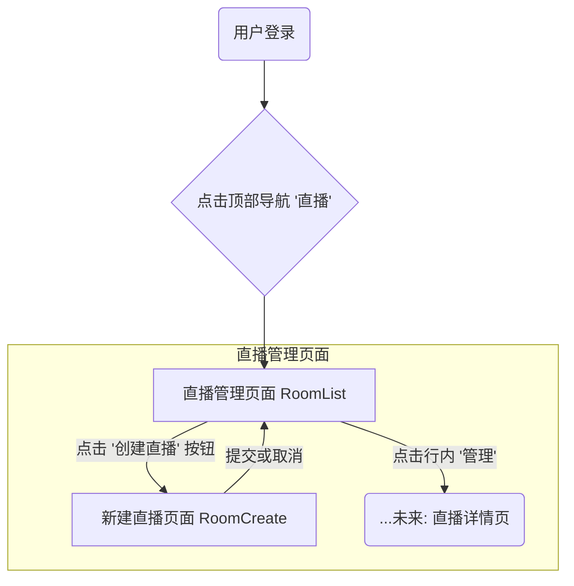

# 前端分析及设计文档

本文档旨在分析和定义项目前端各个页面的UI组件、布局、数据字段、交互逻辑以及对应的API需求。


# 角色定位说明

**作者角色：资深前端工程师**

- 具备大型直播平台（如哔哩哔哩、抖音）前端架构与实现经验。
- 精通 uni-app、Vue3、TypeScript、H5、小程序等多端开发。
- 熟悉高并发、低延迟直播场景下的前端性能优化与用户体验设计。
- 具备团队协作、规范制定、前后端协同与持续集成能力。

---

# 文档目的与项目背景

## 文档目的
本设计文档旨在为“直播SaaS平台”前端项目 提供系统性、标准化的设计与开发指导，确保团队协作高效、代码质量可控、功能实现与后端接口高度一致。本项目目标是实现一套可在PC浏览器、Android App、iOS App和微信小程序等多端部署的直播平台前端，满足多端用户的直播观看、推流、互动等需求。
## 项目背景
- 平台采用前后端分离架构，后端接口详见《直播核心功能设计文档.md》。
- 前端基于 uni-app 实现，需支持H5、Android、iOS、微信小程序等多端适配。


# 重要声明：本次前端改造的范围与原则（请务必先行阅读）

为避免歧义，特此郑重声明：

1) 本项目的前端核心功能已完成并在现有代码中稳定运行（接口调用、状态管理、权限/路由守卫、数据处理与错误处理、埋点等“业务逻辑层”均已实现）。
2) 当前工作的唯一核心目标是“换肤与重构UI层”，即：
   - 在不改动既有业务逻辑的前提下，按照《@前端分析及设计文档.md》的视觉与交互规范，替换页面的模板与样式，实现新的界面设计；
   - 尽量复用原有的 API、Store、Hooks/Utils，禁止从零开始重复实现业务逻辑。
3) 本次改造不属于功能重写，不新增/变更已对齐的业务流程。若确需新增逻辑，须先提交变更说明并经评审确认后纳入后续迭代。

执行原则
- 逻辑复用，视图替换：保留 <script> 中的逻辑（或抽至 hooks/services），仅重写 <template> 与样式层；
- 模块化与可回退：新旧页面可并行（如 /pages/room/new/*），通过开关/路由灰度切换，确保可快速回退；
- 设计令牌统一：颜色、字号、间距、圆角、阴影等以 tokens/变量统一管理，保障全站风格一致与可维护；
- 占位与兜底：后端未就绪字段前端占位（例如主视觉图、分类标签、热度默认值=100），并在文档中标注；
- 验收口径清晰：以本设计文档中“视觉复刻清单”“功能实现清单”与“交互分析”为验收依据。

交付物与边界
- 交付物：基于现有逻辑的“新UI页面/组件”代码、主题变量/设计令牌、必要的路由与开关配置、占位与空态策略；
- 非交付内容：与本次改造无关的业务逻辑更改、后端接口契约调整。

以上声明对本文件其余章节均构成约束性前提。

---

# 一、页面的ui分析

## 1. 页面分析列表

1.  **RoomList (直播房间列表页)**
2.  **RoomCreate (新建直播房间页)**
3.  **RoomManage (直播房间管理页)**
4.  **MultiVenueManage (多会场管理页)**
5.  **LiveView (直播观看页)**
6.  **VenueDisplayPage (主分会场展示页)**

---

## 1. RoomList (直播房间列表页)

### 1.0 复刻范围与实现优先级

本章节明确定义了`RoomList`页面的视觉复刻要求与功能开发范围，是本期工作的核心依据。

#### 1.0.1 视觉复刻清单 (Visual Replication Scope)

目标：精确复刻设计稿的视觉布局与静态组件，达到高保真效果。

需要1:1复刻的UI组件列表：
- [x] 全局导航 (Header)
- [x] 侧边栏 (SideNav)
- [x] 信息提示条 (Alert/Banner)
- [x] 主操作按钮区 (Action Bar)
- [x] 标签页 (Tabs)
- [x] 搜索/筛选表单 (Filter Form)
- [x] 批量操作栏 (Batch Action Bar)
- [x] 数据表格 (Table)
- [x] 底部左右滑动条 (Bottom Horizontal Slider)
- [x] 悬浮按钮 (Floating Action Button)
- [x] 分页器 (Pagination)

#### 1.0.2 功能实现清单 (Functional Implementation Scope)

统一占位策略：所有“暂缓实现”的功能，在用户交互时统一弹出提示：“待开发，敬请期待”。

| UI区域                | 功能点                 | 本期实现 (In Scope) | 暂缓实现 (Deferred)                                       |
| --------------------- | ---------------------- | ------------------- | --------------------------------------------------------- |
| 全局导航 (Header)     | 导航链接跳转           | “直播”              | 其他所有链接                                              |
| 侧边栏 (SideNav)      | 导航链接跳转           | “新建直播”, “直播管理” | 其他所有链接                                              |
| 主操作按钮区          | 按钮点击               | “创建直播”          | “批量创建直播”, “直播全局设置”, “直播教程”                |
| 标签页 (Tabs)         | 切换列表内容           | -                   | 所有标签页的点击切换功能                                  |
| 搜索/筛选表单         | 搜索/筛选功能          | -（静态UI）         | 整个表单的查询功能                                        |
| 批量操作栏            | 批量按钮操作           | -（静态UI）         | 所有按钮的业务功能                                        |
| 数据表格              | 数据加载与展示         | ✅ (API或Mock)      | -                                                         |
| 数据表格              | 行内操作按钮点击反馈   | ✅（至少提示Toast） | 真实业务动作（去开播/群发/更多的后台调用）                |
| 分页器                | 翻页功能               | ✅ (API或Mock)      | -                                                         |

---

### 1.1 UI组件分析

为确保“复刻内容”和“实现内容”清晰可执行，本节拆分为：
- 1.1.1 需要1:1复刻的UI清单（含按钮名称与位置）
- 1.1.2 本期需要实现的功能点

#### 1.1.1 需要1:1复刻的UI清单（含按钮名称与位置）

- 顶部全局导航（Header，页面最顶，左右分区布局）：
  - 左侧：
    - Logo与标题：“Med-Scholar的直播间”（点击首页）。
    - 主导航按钮（从左到右）：
      1) 首页  2) 直播（高亮） 3) 营销 4) 内容 5) 商品 6) 交易 7) 用户 8) 数据 9) 企微
    - 下拉入口：社区团购（文本右侧下拉箭头）。
  - 右侧：
    - 全局搜索框（占位文案：搜索功能与帮助，位于右侧功能图标之前）。
    - 功能图标按钮（自左向右）：A（智能助手）、?（帮助）、书签、下载、铃铛（通知）、刷新。
    - 用户头像（最右侧）。

- 左侧边栏（SideNav，页面左侧，纵向排列）：
  - 顶部模块标题：“直播”（右侧小刷新图标）。
  - 菜单项（自上而下）：
    - 新建直播（图标+文字）
    - 直播管理（高亮，图标+文字）
    - 频道管理
    - 图片直播
    - 软件下载
    - 通用设置
    - 多渠道分发
    - 直播中控台（右侧徽标：NEW）
    - 执行服务（右侧徽标：HOT）
  - 底部分区：常用功能（分隔线下方）。

- 信息提示条（内容区顶部，Action Bar 上方）：
  - 文案：“当前直播间分数：100分（正常）”，右侧链接：“查看分数明细”。

- 主操作按钮区（Action Bar，提示条下方，从左到右）：
  - 创建直播（主色按钮）
  - 批量创建直播（次要按钮）
  - 直播全局设置（带图标）
  - 直播教程（带图标）

- 标签页（Tabs，主按钮操作区右侧同一行，居左对齐）：
  - 待整改直播内容（0） | 分类管理 | 回收站

- 搜索/筛选表单（Filter Form，横向排列，标签与控件对齐）：
  - 下拉：所有筛选
  - 下拉：直播名称
  - 输入框：请输入直播名称
  - 按钮：搜索（靠右显示或紧随输入框右侧）

- 批量操作栏（出现于表格上方，当有勾选时；从左到右）：
  - 已选N条 | 批量操作：
    - 移入分类 | 所属频道 | 上架 | 下架 | 回收 | 结束 | 恢复未开始 | 复制 | 下载二维码 | 下载话题链接

- 数据表格（Table，列从左到右）：
  - 选择框 | 直播ID | 直播（含封面缩略图+标题+标签：公开/上架等） | 直播类型 | 直播形式 | 直播状态 | 频道 | 开始时间 | 直播分类 | 热度 | 排序 | 操作
  - 行内操作（操作列，从左到右）：去开播 | 开播通知群发 | 管理 | 更多（...）

- 底部左右滑动条（表格底部，用于横向滚动宽表格）。

- 分页器（最底部，右侧对齐）：
  - 每页条数选择（10条/页） | 上一页 | 页码按钮（1,2,3,4,5,…） | 下一页 | 跳页输入（可选）。

- 悬浮按钮（右下角圆形按钮，覆盖在内容之上）。

#### 1.1.2 本期需要实现的功能点

- 路由/导航
  - 顶部全局导航：当成功登录以后就是在“直播”（高亮显示）为 `/pages/room/RoomList`；其余显示“待开发，敬请期待”。
  - 左侧边栏：
    - 直播管理：进入 `/pages/room/RoomList`。
    - 新建直播：进入 `/pages/room/RoomCreate`。
    - 其他项：统一显示“待开发，敬请期待”。

- 主操作按钮区
  - 创建直播：进入 `/pages/room/RoomCreate`。
  - 其他按钮：统一显示“待开发，敬请期待”。

- 搜索/筛选表单
  - 静态UI；点击“搜索”仅弹出“待开发，敬请期待”。

- 批量操作栏
  - 复刻UI与选中计数；点击任一按钮弹出“功能开发中”。

- 数据表格与分页
  - 列表数据加载与渲染：接真实接口 `GET /api/v1/rooms`，如未就绪则使用Mock。
  - 分页切换（上一页/下一页/页码/每页条数）。
  - 行内操作按钮：点击至少有反馈（Toast）；“管理”可选跳转到详情/设置页（若暂未实现则也提示“待开发”）。

---

### 1.2 布局分析

- 整体布局：经典后台管理系统三段式布局（Top, Left, Main）。
- 主内容区布局：从上至下依次为：信息提示条 -> 主操作按钮区 -> 标签页 -> 搜索筛选区 -> 批量操作栏(条件性显示) -> 数据表格区 -> 底部左右滑动条与分页器。

### 1.3 页面字段分析

| 字段名 (推测)         | 中文标签    | 备注                             |
| --------------------- | -----------|-------------------------------- |
| `id`                  | 直播ID     |唯一标识符                        |
| `title`               | 直播       |直播的主标题                      |
| `coverImage`          | 直播       |封面图片地址                      |
| `visibility`          | (标签)     |公开/加密                         |
| `publishStatus`       | (标签)     |上架/下架                         |无
| `type`                | 直播类型   |例如 “视频直播”                    |无
| `format`              | 直播形式   |例如 “直播”                        |无
| `status`              | 直播状态   |正在推流 / 未开始 / 直播中 / 已结束 |（字段内容不一致）
| `channel`             | 频道       |所属频道                           |无
| `startTime`           | 开始时间   |格式 YYYY-MM-DD HH:MM:SS           |
| `category`            | 直播分类   |所属分类                            |分类id？？？，不是分类名字
| `heat`                | 热度       |热度值，可排序                      |无
| `sortOrder`           | 排序       |自定义排序值，可排序                 |无

**目前数据库设计**
*live_rooms（直播房间表）*
| 字段名           | 类型      | 说明                       |
|------------------|-----------|----------------------------|
| id               | UUID      | 主键，房间唯一标识         |
| user_id          | UUID      | 房间所有者用户ID（可为空） |
| parent_room_id   | UUID      | 父房间ID（分会场用）       |
| title            | VARCHAR   | 房间标题                   |
| description      | TEXT      | 房间描述                   |
| cover_url        | VARCHAR   | 封面图片URL                |
| stream_key       | VARCHAR   | 推流密钥，唯一              |
| is_private       | BOOLEAN   | 是否私密                   |
| record_by_default| BOOLEAN   | 是否默认录制               |
| category_id      | UUID      | 分类ID（可为空）           |
| created_at       | TIMESTAMPTZ | 创建时间                 |
| updated_at       | TIMESTAMPTZ | 更新时间                 |

- **关系**：自引用parent_room_id实现主会场-分会场结构；与live_sessions为一对多关系。

*live_sessions（直播场次表）*
| 字段名           | 类型      | 说明                       |
|------------------|-----------|----------------------------|
| id               | UUID      | 主键，场次唯一标识         |
| room_id          | UUID      | 所属房间ID，外键           |
| status           | ENUM      | 会话状态（scheduled/live等）|
| start_time       | TIMESTAMPTZ | 开始时间                 |
| end_time         | TIMESTAMPTZ | 结束时间（可为空）        |
| video_id         | UUID      | 关联媒资ID（可为空）       |
| created_at       | TIMESTAMPTZ | 创建时间                 |
| updated_at       | TIMESTAMPTZ | 更新时间                 |


### 1.4 页面间的跳转流程及交互分析



- 底部左右滑动条：通过左右滑动在宽表格/长信息中横向浏览。
- 批量操作：勾选 ≥1 行后出现批量操作栏；点击其中任何按钮显示“功能开发中”。
- 主操作按钮区：点击“创建直播”进入创建页；其余按钮显示“待开发，敬请期待”。
- 顶部导航与侧边栏：非本期范围的入口一律弹出“待开发，敬请期待”。
- 搜索/筛选：组件可输入/选择，但不触发查询；点击“搜索”显示占位提示。

### 1.5 API需求分析

**获取直播房间列表**
- 功能: 分页获取所有直播房间列表，用于在数据表格中展示。
- 接口: GET /api/v1/rooms

**创建直播房间**
- 功能: 用于“新建直播”功能。点击按钮后，跳转到创建页面，提交表单时调用此接口。
- 接口: POST /api/v1/rooms

**删除直播房间**
- 功能: 用于行内操作的“删除”或批量操作的“回收站”。
- 接口: DELETE /api/v1/rooms/{room_id}

**获取单个房间详情**
- 功能: 用于点击“管理”按钮跳转到详情页时加载数据。
- 接口: GET /api/v1/rooms/{room_id}

**更新直播房间**
- 功能: 用于详情页的编辑功能，或RoomList页未来的批量操作（如批量上架、修改分类等）。
- 接口: PATCH /api/v1/rooms/{room_id}

---

### 1.6 全局导航（复刻规范）

- 可用性范围：仅“直播”可用并进入 `/pages/room/RoomList`；其余项点击统一提示“待开发，敬请期待”。
- 点击顶部导航“直播”，应默认进入“直播管理”（/pages/room/RoomList）。
- 其余规范同前（样式、交互、可访问性）。

### 1.7 侧边栏（复刻规范）

- 可用性范围：仅“直播管理”(`/pages/room/RoomList`) 与 “新建直播”(`/pages/room/RoomCreate`) 可用；其余项点击统一提示“待开发，敬请期待”。
- 其余规范同前（折叠、徽标、权限）。

---

## 2. RoomCreate (新建直播房间页)

本页面用于创建新的直播房间，是直播流程的起点。

### 2.0 复刻范围与实现优先级

本章节明确定义了`RoomCreate`页面的视觉复刻要求与功能开发范围，是本期工作的核心依据。

#### 2.0.1 视觉复刻清单 (Visual Replication Scope)

目标：精确复刻设计稿的视觉布局与静态组件，达到高保真效果。

需要1:1复刻的UI组件列表：
- [x] 全局导航 (Header)
- [x] 侧边栏 (SideNav)
- [x] 顶部类型选择标签页 (Type Selection Tabs)
- [x] 表单容器 (Form Container)
- [x] 直播形式选择 (Radio Group)
- [x] 直播名称输入框 (Input Field)
- [x] 开始时间选择器 (DateTime Picker)
- [x] 显示模式选择 (Radio Group)
- [x] 直播封面上传器 (Image Uploader)
- [x] 直播分类选择器 (Category Selector)
- [x] 所属频道选择器 (Channel Selector)
- [x] 观看方式标签页 (Access Mode Tabs)
- [x] 回放方式选择 (Radio Group)
- [x] 生成回放视频选择 (Segmented Control)
- [x] 回放有效期选择 (Radio Group)
- [x] 底部固定操作栏 (Fixed Action Bar)

#### 2.0.2 功能实现清单 (Functional Implementation Scope)

统一占位策略：所有"暂缓实现"的功能，在用户交互时统一弹出提示："待开发，敬请期待"。

| UI区域                | 功能点                 | 本期实现 (In Scope) | 暂缓实现 (Deferred)                                       |
| --------------------- | ---------------------- | ------------------- | --------------------------------------------------------- |
| 全局导航 (Header)     | 导航链接跳转           | "直播"              | 其他所有链接                                              |
| 侧边栏 (SideNav)      | 导航链接跳转           | "新建直播", "直播管理" | 其他所有链接                                              |
| 顶部类型选择          | 标签页切换             | -（静态UI）         | 所有标签页的点击切换功能                                  |
| 直播形式选择          | 单选切换               | -（静态UI）         | 选项切换的业务逻辑                                        |
| 直播名称输入          | 文本输入与校验         | ✅ (必填校验)       | -                                                         |
| 开始时间选择          | 日期时间选择           | ✅ (组件交互)       | "设置开播提醒"链接功能                                    |
| 显示模式选择          | 单选切换               | -（静态UI）         | 选项切换的业务逻辑                                        |
| 直播封面上传          | 图片上传与预览         | ✅ (文件上传)       | "选择封面模版"、"使用教程"链接                            |
| 直播分类选择          | 分类选择               | -（静态UI）         | "添加分类"按钮、分类数据加载                              |
| 所属频道选择          | 频道选择               | -（静态UI）         | "选择频道"按钮、频道数据加载                              |
| 观看方式选择          | 公开/加密切换          | ✅ (状态切换)       | 加密密码设置等扩展功能                                    |
| 回放方式选择          | 单选切换               | -（静态UI）         | 选项切换的业务逻辑                                        |
| 生成回放视频选择      | 分段控制切换           | -（静态UI）         | "自动打点"开关、选项切换逻辑                              |
| 回放有效期选择        | 单选切换               | -（静态UI）         | 时段设置等扩展功能                                        |
| 底部操作栏            | 按钮操作               | ✅ (返回/提交)      | -                                                         |

---

### 2.1 UI组件分析

为确保"复刻内容"和"实现内容"清晰可执行，本节拆分为：
- 2.1.1 需要1:1复刻的UI清单（含控件名称与位置）
- 2.1.2 本期需要实现的功能点

#### 2.1.1 需要1:1复刻的UI清单（含控件名称与位置）

- 全局导航（Header，复用RoomList页面样式）：
  - 与RoomList页面完全一致，但当前高亮项为"直播"。

- 左侧边栏（SideNav，复用RoomList页面样式）：
  - 与RoomList页面完全一致，但当前高亮项为"新建直播"。

- 顶部类型选择标签页（页面主内容区顶部，横向排列）：
  - 标签选项（从左到右）：视频直播（默认选中） | 图文直播 | VR直播 | 语音直播 | 画板直播

- 表单区域（主内容区，纵向排列，分为多个区块）：

  **基本信息区块**：
  - 直播形式（Radio Group，横向排列）：直播（默认选中） | 点播/录播 | 伪直播
  - 直播名称（Input Field）：文本输入框，占位文案"请输入直播名称，100字内"
  - 开始时间（DateTime Picker）：日期时间选择器，右侧链接"设置开播提醒"
  - 显示模式（Radio Group，横向排列）：横屏（默认选中） | 竖屏 | 三分屏

  **封面设置区块**：
  - 直播封面（Image Uploader）：
    - 上传区域（虚线框，中央上传图标）
    - 格式提示文字："支持JPG、PNG格式，建议尺寸16:9，大小不超过2MB"
    - 底部链接："选择封面模版" | "点击查看使用教程"

  **分类频道区块**：
  - 直播分类（Selector）：标签式选择器，右侧按钮"+ 添加分类"
  - 所属频道（Selector）：标签式选择器，右侧按钮"+ 选择频道"

  **观看设置区块**：
  - 观看方式（Tabs，横向排列）：公开（默认选中） | 加密

  **回放设置区块**：
  - 回放方式（Radio Group，纵向排列）：结束后回放（默认选中） | 实时回放 | 结束后不回放
  - 生成回放视频（Segmented Control，横向排列）：单个视频（默认选中） | 多个视频，右侧开关"开启自动打点"
  - 回放有效期（Radio Group，纵向排列）：无限制（默认选中） | 全天 | 部分时段

- 底部固定操作栏（Fixed Action Bar，页面底部固定）：
  - 返回（Secondary Button，左侧）
  - 立即创建（Primary Button，右侧）

#### 2.1.2 本期需要实现的功能点

- 路由/导航
  - 全局导航：当前在"直播"模块，点击其他模块显示"待开发，敬请期待"。
  - 左侧边栏：
    - 新建直播：当前页面（高亮显示）。
    - 直播管理：跳转到 `/pages/room/RoomList`。
    - 其他项：统一显示"待开发，敬请期待"。

- 表单交互
  - 直播名称：文本输入，必填校验，字符限制100字。
  - 开始时间：日期时间选择器，默认当前时间。
  - 直播封面：图片上传功能，格式校验，大小限制。
  - 观看方式：公开/加密切换，影响`is_private`字段值。

- 静态UI展示
  - 顶部类型选择：默认选中"视频直播"，点击其他选项无实际切换逻辑。
  - 直播形式：默认选中"直播"，点击其他选项无实际切换逻辑。
  - 显示模式：默认选中"横屏"，点击其他选项无实际切换逻辑。
  - 直播分类/所属频道：静态展示，"添加分类"/"选择频道"按钮点击提示"待开发"。
  - 回放相关选项：所有选项保持默认选中状态，点击切换无实际逻辑。

- 底部操作
  - 返回：跳转回 `/pages/room/RoomList`。
  - 立即创建：表单校验通过后调用创建接口，失败时显示错误提示。

-   **全局/侧边导航**: (复用) 与`RoomList`页一致，但侧边栏当前高亮项为“新建直播”。
-   **顶部类型选择 (Tabs)**: 用于选择大的直播类型，如“横屏竖屏”、“视频直播”、“图文直播”、“VR直播”、“语音直播”、“画板直播”。
-   **表单 (Form)**: 整个页面的核心，包含多个输入控件，分为不同区块。
    -   **直播形式 (Radio Group)**: 选项：“直播”、“点播/录播”、“伪直播”。
    -   **直播名称 (Input)**: 文本输入框，有占位提示“请输入直播名称，100字内”。
    -   **开始时间 (DateTime Picker)**: 日期和时间选择器，并附有“设置开播提醒”链接。
    -   **显示模式 (Radio Group)**: 选项：“横屏”、“竖屏”、“三分屏”。
    -   **直播封面 (Image Uploader)**: 图片上传控件，包含预览区、尺寸/格式/大小限制提示、以及“选择封面模版”和“点击查看使用教程”两个链接。
    -   **直播分类 (Selector)**: 标签式选择器，右侧有“+ 添加分类”按钮。
    -   **所属频道 (Selector)**: 标签式选择器，右侧有“+ 选择频道”按钮。
    -   **观看方式 (Tabs)**: 标签页形式的单选项，选项：“公开”、“加密”
    -   **回放方式 (Radio Group)**: 选项：“结束后回放”、“实时回放”、“结束后不回放”。
    -   **生成回放视频 (Segmented Control/Radio)**: 选项：“单个视频”、“多个视频”，右侧有“开启自动打点”的开关(Switch)。
    -   **回放有效期 (Radio Group)**: 选项：“无限制”、“全天”、“部分时段”。
-   **底部操作栏 (Fixed Action Bar)**: 固定在页面底部的操作区。
    -   `Button` (Secondary): “返回”。
    -   `Button` (Primary): “立即创建”。

### 2.2 布局分析

-   **整体布局**: 沿用后台管理系统的三段式布局（Top, Left, Main）。
-   **主内容区布局**: 
    1.  顶部是直播类型选择Tabs。
    2.  主体是一个从上到下的长表单，按逻辑分为“基本信息”、“观看设置”、“回放设置”等多个区块。
    3.  底部是固定的操作栏，不随页面滚动而消失，方便用户随时提交或返回。

### 2.3 页面字段分析 (已对齐开发范围)

| UI标签 | 对应后端字段 | UI控件 | 备注与实现策略 |
| :--- | :--- | :--- | :--- |
| 直播名称 | `title` | Input | **本期实现**。提交时作为API参数。 |
| 开始时间 | `start_time` | DateTime Picker | **本期实现**。提交时作为API参数。 |
| 直播封面 | `cover_url` | Uploader | **本期实现**。需处理图片上传并获取URL后提交。 |
| 观看方式 | `is_private` | Tabs | **本期实现**。"公开"对应`false`，"加密"对应`true`。 |
| --- | --- | --- | --- |
| 直播类型 | (无) | Tabs | **静态复刻**。默认选中"视频直播"，不提交。 |
| 直播形式 | (无) | Radio | **静态复刻**。默认选中"直播"，不提交。 |
| 显示模式 | (无) | Radio | **静态复刻**。默认选中"横屏"，不提交。 |
| 直播分类 | (无) | Selector | **静态复刻**。不提交。 |
| 所属频道 | (无) | Selector | **静态复刻**。不提交。 |
| 回放方式 | (无) | Radio | **静态复刻**。默认选中"结束后回放"，不提交。 |
| 生成回放视频 | (无) | Segmented | **静态复刻**。默认选中"单个视频"，不提交。 |
| 回放有效期 | (无) | Radio | **静态复刻**。默认选中"无限制"，不提交。 |

**目前数据库设计**
*live_rooms（直播房间表）*
| 字段名           | 类型      | 说明                       |
|------------------|-----------|----------------------------|
| id               | UUID      | 主键，房间唯一标识         |
| user_id          | UUID      | 房间所有者用户ID（可为空） |
| parent_room_id   | UUID      | 父房间ID（分会场用）       |
| title            | VARCHAR   | 房间标题                   |
| description      | TEXT      | 房间描述                   |
| cover_url        | VARCHAR   | 封面图片URL                |
| stream_key       | VARCHAR   | 推流密钥，唯一              |
| is_private       | BOOLEAN   | 是否私密                   |
| record_by_default| BOOLEAN   | 是否默认录制               |
| category_id      | UUID      | 分类ID（可为空）           |
| created_at       | TIMESTAMPTZ | 创建时间                 |
| updated_at       | TIMESTAMPTZ | 更新时间                 |


### 2.4 交互分析

-   **加载**: 进入页面，表单显示默认值，如“开始时间”默认为当前时间。
-   **选择联动**: 
    -   选择不同的“观看方式”，下方可能会出现对应的配置项（例如选择“加密”后，出现密码输入框）。
-   **输入校验**: 
    -   “直播名称”等必填项为空时，点击“立即创建”会提示错误。
    -   “直播封面”上传时，会进行客户端的文件格式和大小校验。
-   **弹窗操作**: 点击“添加分类”、“选择频道”等按钮，可能会弹出新的对话框或抽屉进行选择和管理。
-   **提交**: 点击“立即创建”，进行全表单校验。校验通过后，调用创建接口；校验失败，滚动到第一个错误项并提示。
-   **返回**: 点击“返回”，可能会提示用户“有未保存的修改，是否确认离开”，防止误操作导致数据丢失。

### 2.5 API需求分析

1.  **创建直播房间 (POST /api/v1/rooms)**
    -   **功能**: 提交整个表单的数据，创建一个新的直播房间。由于UI字段多于`live_rooms`表，此接口可能需要同时创建`live_rooms`和`live_sessions`记录。
    -   **请求体 (Body)**: 包含`2.3 字段分析`中定义的所有字段数据。
2.  **获取分类/频道列表 (目前无此字段，可能不需要)**
    -   **功能**: 获取用于填充“直播分类”和“所属频道”选择器的数据。
    -   **接口**: 空


## 3. RoomManage (直播房间管理页)

本页面由 RoomList 的数据表格行内“管理”按钮进入，用于对单个直播房间进行管理与配置。

### 3.0 复刻范围与实现优先级

本章节明确定义了`RoomManage`页面的视觉复刻要求与功能开发范围，是本期工作的核心依据。

#### 3.0.1 视觉复刻清单 (Visual Replication Scope)

目标：精确复刻设计稿的视觉布局与静态组件，达到高保真效果。

需1:1复刻的UI组件与布局：
- [x] 顶部全局导航与右上工具组（复用）
- [x] 左侧房间管理侧边栏（复用）
- [x] 页面头部信息区（直播标题、状态、观看方式、开播时间、封面预览、右侧“进入直播/开播设置”按钮）
- [x] 功能卡片分区（网格布局）
      - 基本设置区块：基本设置、观看页设置、广告设置、订阅设置、私域引流
      - 直播方式区块：多会场直播、多语言直播
      - 内容安全区块：白名单、跑马灯
      - 其他区块：进入弹窗、推荐话题、页面跳转、智能字幕等

#### 3.0.2 功能实现清单 (Functional Implementation Scope)

统一占位策略：所有"暂缓实现"的功能，在用户交互时统一弹出提示："待开发，敬请期待"。
| UI区域                | 功能点                 | 本期实现 (In Scope) | 暂缓实现 (Deferred)               |
| --------------------- | ---------------------- | ------------------- | -------------------------------- |
| 页面头部信息区         | 直播名称显示	          |✅ 动态数据展示      | -
| 页面头部信息区         | 直播状态显示	          |✅ 动态数据展示      | -
| 页面头部信息区         | 观看方式显示（公开/加密） |✅ 动态数据展示    | -
| 页面头部信息区         | 开播时间显示           |✅ 动态数据展示      | -
| 页面头部信息区         | 进入直播按钮	          |✅ 跳转逻辑          | 观看页设置/广告设置/订阅设置/私域引流
| 基本设置区块           | 基本设置卡片           |✅ 点击进入子页      | -
| 直播方式区块           | 多会场直播卡片	        |✅ 点击进入子页      | 多语言直播
| 内容安全区块/其他      | 白名单/跑马灯/其他功能卡片 |-（静态UI）       | 全部
### 3.1 UI组件分析

为确保"复刻内容"和"实现内容"清晰可执行，本节拆分为：
- 3.1.1 需要1:1复刻的UI清单（含控件名称与位置）
- 3.1.2 本期需要实现的功能点

#### 3.1.1 需要1:1复刻的UI清单（含控件名称与位置）

- 左侧侧边栏（常用功能、当前高亮：基本信息、直播互动、直播营销、数据分析、直播装修、开播设置、内容总结、营销自动化）

- 页面头部信息区（主内容顶部）
    - 左上：返回“直播管理列表”的面包屑/返回按钮
    - 标题行：直播名称（长标题可裁剪/Tooltip）
    - 次行：状态标签（未开始/直播中/已结束）、观看方式（公开/加密）、类型与场景标签（如横屏直播）、开播时间（YYYY-MM-DD HH:mm）
    - 左侧：封面大图预览，角标显示“未开播/直播中”等
    - 右侧：两个按钮：进入直播（主按钮）、开播设置（次按钮，静态占位）

- 功能卡片网格区
    - 基本设置区块（4列栅格卡片）
        - 基本设置（必须实现）
        - 观看页设置（静态）
        - 广告设置（静态）
        - 订阅设置（静态）
        - 私域引流（静态）
    - 直播方式区块
        - 多会场直播（必须实现，卡片右侧“进入”按钮）
        - 多语言直播（静态）
    - 内容安全区块
        - 白名单（静态）
        - 跑马灯（静态）
    - 其他区块
        - 进入弹窗/推荐话题/页面跳转/智能字幕/管理员设置（全静态）

#### 3.1.2 本期需要实现的功能点
- 头部信息区动态展示
  - 直播名称：从API加载并展示
  - 直播状态：从API加载状态并显示不同徽标/颜色
  - 观看方式：显示“公开/加密”
  - 开播时间：格式化展示
  - 进入直播按钮：点击跳转（参见“路由设计”）
  - 开播设置按钮：静态占位，点击提示“待开发，敬请期待”

- 功能卡片交互
  - 基本设置：点击进入“基本设置”子页（需新路由）
  - 多会场直播：点击进入“多会场直播”子页（需新路由）
  - 其他卡片：点击均统一提示“待开发，敬请期待”

### 3.2 布局分析

-   **整体布局**: Top（全局导航）- Left（管理侧边栏）- Main（信息头+卡片网格）
-   **主内容区布局**: 信息头部（封面/标题/状态/时间/按钮）在上；卡片网格区按区块分组，自上而下排列

### 3.3 页面字段分析 

| UI标签   | UI控件 | 备注与实现策略 |
| 直播名称 | Input | **本期实现**。提交时作为API参数。 |
| 开始时间 |  DateTime Picker | **本期实现**。提交时作为API参数。 |
| 直播封面 |  Uploader | **本期实现**。需处理图片上传并获取URL后提交。 |
| 观看方式 |  Tabs | **本期实现**。"公开"对应`false`，"加密"对应`true`。 |
| 直播状态 | statu |**目标字段**：正在推流 / 未开始 / 直播中 / 已结束 |（字段内容不一致）

**目前数据库设计**
*live_rooms（直播房间表）*
| 字段名           | 类型      | 说明                       |
|------------------|-----------|----------------------------|
| id               | UUID      | 主键，房间唯一标识         |
| user_id          | UUID      | 房间所有者用户ID（可为空） |
| parent_room_id   | UUID      | 父房间ID（分会场用）       |
| title            | VARCHAR   | 房间标题                   |
| description      | TEXT      | 房间描述                   |
| cover_url        | VARCHAR   | 封面图片URL                |
| stream_key       | VARCHAR   | 推流密钥，唯一              |
| is_private       | BOOLEAN   | 是否私密                   |
| record_by_default| BOOLEAN   | 是否默认录制               |
| category_id      | UUID      | 分类ID（可为空）           |
| created_at       | TIMESTAMPTZ | 创建时间                 |
| updated_at       | TIMESTAMPTZ | 更新时间                 |

- **关系**：自引用parent_room_id实现主会场-分会场结构；与live_sessions为一对多关系。

*live_sessions（直播场次表）*
| 字段名           | 类型      | 说明                       |
|------------------|-----------|----------------------------|
| id               | UUID      | 主键，场次唯一标识         |
| room_id          | UUID      | 所属房间ID，外键           |
| status           | ENUM      | 会话状态（scheduled/live等）|
| start_time       | TIMESTAMPTZ | 开始时间                 |
| end_time         | TIMESTAMPTZ | 结束时间（可为空）        |
| video_id         | UUID      | 关联媒资ID（可为空）       |
| created_at       | TIMESTAMPTZ | 创建时间                 |
| updated_at       | TIMESTAMPTZ | 更新时间                 |

### 3.4 交互分析

-   **加载**: 根据路由参数 room_id 请求房间详情数据；渲染名称、状态、观看方式、开播时间、封面
-   **进入直播**: 
    -   点击后跳转至直播观看页（LiveView），或根据状态决定提示/跳转
-   **基本设置**: 
    -   点击卡片进入“基本设置”子页面（可编辑标题、封面、观看方式等）
-   **多会场直播**: 点击卡片“进入”，进入多会场管理页面
-   **其他卡片**: 点击均统一提示“待开发，敬请期待”

### 3.5 API需求分析

1.  **获取房间详情：GET /api/v1/rooms/{room_id}**
    -   **功能**: 用于头部信息与封面显示。需包含：title, cover_url, is_private、当前场次状态与start_time（建议聚合）。

## 4. MultiVenueManage (多会场管理页)

### 4.0 复刻范围与实现优先级

本章节明确定义了`RoomManage`页面的视觉复刻要求与功能开发范围，是本期工作的核心依据。

#### 4.0.1 视觉复刻清单 (Visual Replication Scope)

目标：精确复刻设计稿的视觉布局与静态组件，达到高保真效果。

需1:1复刻的UI组件与布局：
- [x] 顶部全局导航与左侧侧边栏（复用）
- [x] 页面头部设置区（含“多会场直播”总开关、主/全会场名称、显示位置、示例/修改/使用指南等元素）
- [x]列表操作栏（“添加分会场”按钮、筛选下拉、搜索框）
- [x]分会场数据列表区：数据表格（与 RoomList 风格保持一致）
- [x] 列表分页器（与 RoomList 风格保持一致）

#### 4.0.2 功能实现清单 (Functional Implementation Scope)

统一占位策略：所有"暂缓实现"的功能，在用户交互时统一弹出提示："待开发，敬请期待"。
- 本期实现 (In Scope)
    - 添加分会场（新建弹窗）
    - 分会场列表加载与表格渲染
    - 分页
- 暂缓实现 (Deferred)
    - 多会场直播总开关（开/关）
    - 分会场搜索与筛选
    - 头部“示例”/“使用指南”跳转
    - 头部“修改”后的设置保存流程（除非与后端已对齐）
    - 分会场卡片内更丰富的快捷操作（如一键分享、复制链接、更多菜单等）

### 4.1 UI组件分析

为确保"复刻内容"和"实现内容"清晰可执行，本节拆分为：
- 4.1.1 需要1:1复刻的UI清单（含控件名称与位置）
- 4.1.2 本期需要实现的功能点

#### 4.1.1 需要1:1复刻的UI清单（含控件名称与位置）

- 左侧侧边栏（常用功能、当前高亮：基本信息、直播互动、直播营销、数据分析、直播装修、开播设置、内容总结、营销自动化）

- 左侧侧边栏：复用管理页样式，当前高亮“多会场直播”
- 页面头部设置区（Setting Panel）
    - 顶部标题“多会场直播”，右侧Switch总开关（右侧“示例”超链接）
    - 表单行：
        - 菜单名称：Input + 计数（如 4/20）+ 开关（控制是否显示分会场信息）
        - 主会场名称：Input（3/20）+ “修改”按钮
        - 显示位置：Radio（“视频下方示例”“视频右侧示例”等）+ 说明文案
    - 列表操作栏（List Toolbar）
        - “添加分会场”按钮（Primary）
        - 筛选下拉（默认“全部”）
        - 关键字搜索框（占位：请输入会场名称）
    - 分会场列表（数据表格，Data Table）
      - 表格列（从左到右）：会场封面 | 会场名称 | 会场ID | 直播时间 | 状态 | 排序 | 操作
      - 行内操作（操作列）：获取推拉流地址 | 编辑 | 结束
    - 分页器（右下角，与 RoomList 一致）

#### 4.1.2 本期需要实现的功能点

- 进入页面加载分会场列表（默认第一页、size=10/20，按UI指定）
- 点击“添加分会场”跳转到创建流程（可复用 RoomCreate，parent_room_id=当前主会场）
- 切换分页页码与每页条数

### 4.2 布局分析

-   **整体布局**: Top（全局导航）- Left（管理侧边栏）- Main（设置区 + 操作栏 + 列表 + 分页）
-   **数据表格**：样式与 `RoomList` 页面保持一致。

**目前数据库设计**
*live_rooms（直播房间表）*
| 字段名           | 类型      | 说明                       |
|------------------|-----------|----------------------------|
| id               | UUID      | 主键，房间唯一标识         |
| user_id          | UUID      | 房间所有者用户ID（可为空） |
| parent_room_id   | UUID      | 父房间ID（分会场用）       |
| title            | VARCHAR   | 房间标题                   |
| description      | TEXT      | 房间描述                   |
| cover_url        | VARCHAR   | 封面图片URL                |
| stream_key       | VARCHAR   | 推流密钥，唯一              |
| is_private       | BOOLEAN   | 是否私密                   |
| record_by_default| BOOLEAN   | 是否默认录制               |
| category_id      | UUID      | 分类ID（可为空）           |
| created_at       | TIMESTAMPTZ | 创建时间                 |
| updated_at       | TIMESTAMPTZ | 更新时间                 |

- **关系**：自引用parent_room_id实现主会场-分会场结构；与live_sessions为一对多关系。

*live_sessions（直播场次表）*
| 字段名           | 类型      | 说明                       |
|------------------|-----------|----------------------------|
| id               | UUID      | 主键，场次唯一标识         |
| room_id          | UUID      | 所属房间ID，外键           |
| status           | ENUM      | 会话状态（scheduled/live等）|
| start_time       | TIMESTAMPTZ | 开始时间                 |
| end_time         | TIMESTAMPTZ | 结束时间（可为空）        |
| video_id         | UUID      | 关联媒资ID（可为空）       |
| created_at       | TIMESTAMPTZ | 创建时间                 |
| updated_at       | TIMESTAMPTZ | 更新时间                 |

### 4.4 交互分析

-   **加载**: 根据路由参数 room_id 请求分会场房间详情数据；渲染名称、状态、开播时间、封面
- **分会场表格交互**：
    - **行内操作**：
        - **编辑**：点击后跳转到该分会场的编辑页面（可复用 `RoomCreate` 页面并填充现有数据）。
        - **结束**：点击后弹出确认对话框，确认后调用API执行相应操作。
- **添加分会场**：点击“添加分会场”按钮，出现创建分会场的弹窗，并自动填充 `parent_room_id` 为当前主会场的ID。

### 4.5 API需求分析

| **创建计划场次** | `POST` | `/api/v1/rooms/{room_id}/sessions` | 为指定房间预先创建一个“计划中”(`scheduled`)的直播场次。 |
| **获取场次列表** | `GET` | `/api/v1/rooms/{room_id}/sessions` | 分页获取指定房间的所有历史和计划直播场次。 |
| **获取场次详情** | `GET` | `/api/v1/sessions/{session_id}` | 获取单场直播的详细信息，包含其实时状态和统计数据。**这是判断是否在直播的核心接口。** |
| **更新计划场次** | `PATCH` | `/api/v1/sessions/{session_id}` | 更新一个还未开始的计划场次的信息，如修改预告时间、标题等。 |
| **删除计划场次** | `DELETE` | `/api/v1/sessions/{session_id}` | 删除一个还未开始或已结束的直播场次。不能删除正在直播的场次。 |

## 5. LiveView (直播观看页)

 - 本页面面向观众端，承载直播视频观看、弹幕/聊天互动与基础信息展示。以下为“直播进行时”的页面分析与实现范围。

### 5.0 复刻范围与实现优先级

[x] 顶部信息条（标题、热度、开播时间、状态徽标）
[x] 视频播放器区域（直播流/封面）
[x] 播放器下方页签（直播介绍 / 病例介绍 / 返回主会场）
[x] 右侧聊天互动区（消息流、表情、输入发送）

- 优先级建议：
    - P0：播放器拉流、右侧聊天基础收发、点赞/热度、顶部信息条
    - P1：介绍/病例页签内容渲染、返回主会场跳转
    - P2：表情面板动画、聊天室管理（禁言/屏蔽词）占位

### 5.1 UI组件分析

- 顶部信息条
    - 标题：如“9月12日 ××教授 ××医院”
    - 状态徽标：直播中/未开始/回放中（颜色区分）
    - 热度与时间：小圆点+热度（例：1.83万），开播时间（YYYY/MM/DD HH:mm:ss）
    - 右侧操作：举报/投诉、分享
- 主视频区（Player）
- 功能页签（播放器下方）
    - 直播介绍（富文本）
    - 病例介绍（医教场景摘要）
    - 返回主会场（跳转到主分会场展示页）
- 右侧聊天互动（静态待实现）

###5.2 布局分析

- 左主右辅两栏：左侧主内容（信息条 + 播放器 + 页签内容），右侧固定聊天栏
- 播放器 16:9 优先；聊天面板固定宽度（如 320–360px）
- 滚动：右侧聊天独立滚动；主内容区随内容滚动

### 5.3 字段分析

| 字段名 (推测)         | 中文标签    | 备注                            |
| --------------------- | -----------|-------------------------------- |
| `id`                  | 直播ID     |唯一标识符                        |
| `title`               | 直播       |直播的主标题                      |
| `coverImage`          | 直播       |封面图片地址                      |
| `status`              | 直播状态   |正在推流 / 未开始 / 直播中 / 已结束 |（字段内容不一致）

### 5.4 交互与状态

- 播放器
    - 进入自动拉流；失败可重试；弱网降级低清晰度
    - 全屏/音量/清晰度（按对接情况开启）
- 聊天（暂未实现）
    - 登录/设昵称后可发言；新消息自动滚动；支持表情
    - 管理能力（占位）：禁言/置顶/撤回
- 页签
    - 介绍/病例：加载并渲染富文本（目前支持文字，不支持图片）
    - 返回主会场：跳转 RoomManage?room_id={rid}

### 5.5 API需求分析

| 主要功能 | HTTP 方法 | API 端点 | 简要说明 |
| :--- | :--- | :--- | :--- |
| **推流鉴权与激活** | `POST` | `/internal/srs/on_publish` | 由 SRS 服务器在收到推流时回调。用于验证 `stream_key`，并将 `scheduled` 状态的场次激活为 `live`，或为即兴直播创建新的 `live` 场次。 |
| **断流处理** | `POST` | `/internal/srs/on_unpublish` | 由 SRS 服务器在推流断开时回调。用于将 `live` 状态的场次更新为 `finished`，并触发后续处理（如转码）。 |


## 6. VenueDisplayPage (主分会场展示页)

本页面作为主会场下所有分会场的聚合展示入口，通常从单个分会场的直播观看页返回时进入

### 6.0 复刻范围与实现优先级

#### 6.0.1 视觉复刻清单 (Visual Replication Scope)

- [x] 顶部主视觉图 (Banner Image)
- [x] 分类筛选标签页 (Filter Tabs)
- [x] 分会场卡片列表 (Venue Card List)
- [x] 单个分会场卡片 (Venue Card Item)

#### 6.0.2 功能实现清单 (Functional Implementation Scope)

- **本期实现 (In Scope)**
    - **主视觉图**: 前端使用静态占位图片。
    - **分类筛选标签页**: 前端静态占位，无筛选功能。
    - **分会场列表**: 动态加载并渲染，但卡片内的“热度”字段为静态占位。
    - **跳转**: 点击分会场卡片能跳转到对应的 `LiveView` 观看页。

### 6.1 UI组件分析

#### 6.1.1 需要1:1复刻的UI清单

- **顶部主视觉图 (Banner Image)**: 页面最上方的大尺寸图片，作为主活动的视觉标识。
- **分类筛选标签页 (Filter Tabs)**: 位于主视觉图下方，用于按分类（如图中的“云南省”、“湖南省”）筛选分会场列表。
- **分会场卡片列表 (Venue Card List)**: 垂直排列的卡片列表，用于展示所有分会场。
- **单个分会场卡片 (Venue Card Item)**:
    - **左侧**: 封面缩略图，左上角覆盖状态角标（如“未开始”、“回放中”，不同底色）。
    - **右侧**:
        - **标题**: 多行文本，描述直播主题、讲师和机构。
        - **开始时间**: 格式为 `YYYY-MM-DD HH:MM:SS`。
        - **热度**: 显示当前直播的热度值。

### 6.2 布局分析

- **整体布局**: 单列垂直布局。
- **页面结构**: 从上至下依次为：主视觉图 -> 筛选标签页 -> 分会场卡片列表。

### 6.3 页面字段分析

| UI元素 | 对应后端字段 (推测) | 备注 |
| :--- | :--- | :--- |
| 主视觉图 | (无) | **前端静态占位** |
| 分类标签 | (无) | **前端静态占位** |
| 卡片封面 | `cover_url` | 分会场的封面图 |
| 卡片状态 | `status` | 分会场当前场次的状态 |
| 卡片标题 | `title` | 分会场标题 |
| 开始时间 | `start_time` | 分会场开播时间 |
| 热度 | (无) | **前端静态占位** (默认值: 100) |

**目前数据库设计**
*live_rooms（直播房间表）*
| 字段名           | 类型      | 说明                       |
|------------------|-----------|----------------------------|
| id               | UUID      | 主键，房间唯一标识         |
| user_id          | UUID      | 房间所有者用户ID（可为空） |
| parent_room_id   | UUID      | 父房间ID（分会场用）       |
| title            | VARCHAR   | 房间标题                   |
| description      | TEXT      | 房间描述                   |
| cover_url        | VARCHAR   | 封面图片URL                |
| stream_key       | VARCHAR   | 推流密钥，唯一              |
| is_private       | BOOLEAN   | 是否私密                   |
| record_by_default| BOOLEAN   | 是否默认录制               |
| category_id      | UUID      | 分类ID（可为空）           |
| created_at       | TIMESTAMPTZ | 创建时间                 |
| updated_at       | TIMESTAMPTZ | 更新时间                 |

- **关系**：自引用parent_room_id实现主会场-分会场结构；与live_sessions为一对多关系。

*live_sessions（直播场次表）*
| 字段名           | 类型      | 说明                       |
|------------------|-----------|----------------------------|
| id               | UUID      | 主键，场次唯一标识         |
| room_id          | UUID      | 所属房间ID，外键           |
| status           | ENUM      | 会话状态（scheduled/live等）|
| start_time       | TIMESTAMPTZ | 开始时间                 |
| end_time         | TIMESTAMPTZ | 结束时间（可为空）        |
| video_id         | UUID      | 关联媒资ID（可为空）       |
| created_at       | TIMESTAMPTZ | 创建时间                 |
| updated_at       | TIMESTAMPTZ | 更新时间                 |

### 6.4 交互分析

- **加载**:
    - 页面加载时，根据主会场ID获取其主视觉图信息和所有分会场列表数据。
    - 默认显示全部分会场。
- **跳转**:
    - 点击任意一个分会场卡片，应跳转到该分会场的 `LiveView` 观看页面 (`/pages/live/LiveView?room_id={sub_venue_id}`)。
- **筛选 (暂缓)**:
    - 点击分类标签页，应根据分类ID重新请求分会场列表并刷新。

### 6.5 API需求分析

  **获取直播房间列表**
  - 功能: 分页获取所有直播房间列表，用于在数据表格中展示。
  - 接口: GET /api/v1/rooms

# 二、前端开发规范

## 1 代码规范
- 统一风格：全项目采用 ESLint + Prettier 自动格式化，统一2空格缩进，结尾无分号，单引号为主。
- TypeScript 优先：新开发页面和组件必须使用 TypeScript，类型声明完整，接口数据类型与后端保持同步。
- 组件化开发：每个页面/业务功能拆分为小型、可复用的组件，单文件组件（.vue）结构清晰（<template> <script lang=\"ts\"> <style scoped>）。
- 禁止魔法数字/硬编码：所有常量、枚举、配置项集中管理（如 src/common/constants.ts）。
- 注释规范：关键业务逻辑、接口调用、复杂计算必须有中英文注释，函数/组件需有JSDoc风格注释。
- Git 提交规范：采用 Conventional Commits 规范，便于自动化CI/CD和版本管理。

## 2 命名规范
- 变量/函数：`camelCase`（如：liveRoomList）
- 组件/页面：`PascalCase`（如：LiveRoomList.vue）
- 文件/目录：`kebab-case`（如：live-room-list.vue）
- 常量：`UPPER_SNAKE_CASE`（如：MAX_ROOM_COUNT）
- API接口：`api/xxx.js`，服务：`services/xxx.js`
- 状态管理：store/xxx.ts，模块名与业务一致

## 3 项目结构规范
- **[最高标准]** 全局项目结构必须严格遵循以下规范，确保清晰、一致、可维护。所有新文件的创建都必须在此结构下进行。
```plaintext
frontend_live/
├── src/
│   ├── pages/
│   │   ├── room/
│   │   │   └── new/
│   │   │        ├── RoomList.vue
│   │   │        ├── RoomCreate.vue
│   │   │        └── RoomManage.vue
│   │   ├── venue/
│   │   │   └── new/
│   │   │        ├── MultiVenueManage.vue
│   │   │        └── VenueDisplayPage.vue
│   │   ├── live/
│   │   │   └── new/
│   │   │         └── LiveView.vue
│   │   ├── common/
│   │       └── NotFound.vue
│   ├── components/
│   │   ├── AppButton.vue
│   │   ├── ModalDialog.vue
│   │   ├── RoomCard.vue
│   │   └── VideoPlayer.vue
│   ├── store/
│   │   ├── room.ts
│   │   └── session.ts
│   └── api/
│       ├── room.ts
│       └── session.ts
└── tests/
    └── pages/  # 页面测试文件存放目录
```

# 三. 数据库设计（核心表结构）

本节简要介绍直播核心模块的数据库设计，帮助前端理解接口数据结构和字段含义。

## 1 设计原则
- **双表模型**：将直播房间（live_rooms）与直播场次（live_sessions）分离，结构清晰、易扩展。
- **UUID主键**：所有表主键均为UUID，保证全局唯一性。
- **时区兼容**：所有时间戳字段均为TIMESTAMPTZ，统一使用UTC。
- **数据完整性**：通过FOREIGN KEY、UNIQUE、ENUM等约束保证数据准确。

## 2 核心表结构

### 2.1 live_rooms（直播房间表）
| 字段名           | 类型      | 说明                       |
|------------------|-----------|----------------------------|
| id               | UUID      | 主键，房间唯一标识         |
| user_id          | UUID      | 房间所有者用户ID（可为空） |
| parent_room_id   | UUID      | 父房间ID（分会场用）       |
| title            | VARCHAR   | 房间标题                   |
| description      | TEXT      | 房间描述                   |
| cover_url        | VARCHAR   | 封面图片URL                |
| stream_key       | VARCHAR   | 推流密钥，唯一              |
| is_private       | BOOLEAN   | 是否私密                   |
| record_by_default| BOOLEAN   | 是否默认录制               |
| category_id      | UUID      | 分类ID（可为空）           |
| created_at       | TIMESTAMPTZ | 创建时间                 |
| updated_at       | TIMESTAMPTZ | 更新时间                 |

- **关系**：自引用parent_room_id实现主会场-分会场结构；与live_sessions为一对多关系。

### 2.2 live_sessions（直播场次表）
| 字段名           | 类型      | 说明                       |
|------------------|-----------|----------------------------|
| id               | UUID      | 主键，场次唯一标识         |
| room_id          | UUID      | 所属房间ID，外键           |
| status           | ENUM      | 会话状态（scheduled/live等）|
| start_time       | TIMESTAMPTZ | 开始时间                 |
| end_time         | TIMESTAMPTZ | 结束时间（可为空）        |
| video_id         | UUID      | 关联媒资ID（可为空）       |
| created_at       | TIMESTAMPTZ | 创建时间                 |
| updated_at       | TIMESTAMPTZ | 更新时间                 |

- **关系**：与live_rooms为多对一关系；与session_statistics为一对一关系。

### 2.3 session_statistics（场次统计表）
| 字段名           | 类型      | 说明                       |
|------------------|-----------|----------------------------|
| id               | UUID      | 主键，统计唯一标识         |
| session_id       | UUID      | 关联场次ID，唯一外键       |
| peak_viewer_count| INT       | 峰值观众数                 |
| total_viewer_count| BIGINT   | 总观众数                   |
| total_like_count | BIGINT    | 总点赞数                   |
| total_share_count| BIGINT    | 总分享数                   |
| created_at       | TIMESTAMPTZ | 创建时间                 |
| updated_at       | TIMESTAMPTZ | 更新时间                 |

- **关系**：与live_sessions为一对一关系。
